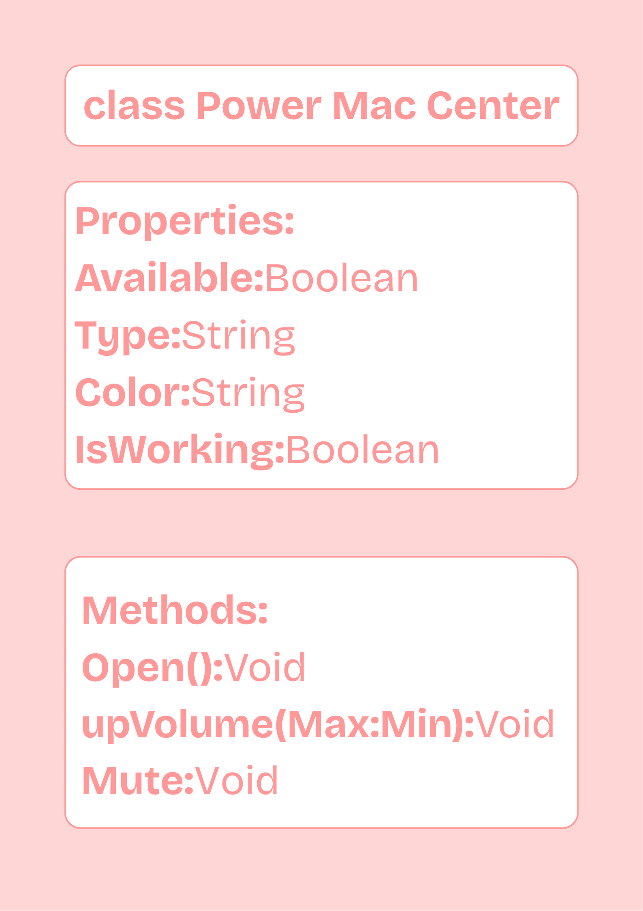

# SG4 - Understanding Classes and Objects
## Power Mac Center
## Class represents this as a place that sells Apple Products.
## Properties
| Property | Data Type | Description |
|---|---|---|
|Available|Boolean|Indicates whether or not the item is available|
|Type|String|It determines what sort of Apple Product it is.|
|Color|String|Color of the Apple Product|
|IsWorking|Boolean|It determines whether or not the product is functioning|

## Methods
| Method | Description |
|---|---|
|Open|This method determines an action which lets the Apple Product turn on|
|upVolume|This method determines a method or action which lets the Apple Product's volume go up|
|Mute|This method determines a method or action which lets the Apple Product's volume mute.|
## Class Diagram

## Design Explanation
### Why did you choose this class?
I chose this because it was the first thing I thought of.
### Which property is the most important? Why?
The most important property is IsWorking because it is important for the Product to be functional.
### Which method is the most useful? Why?
The most important property is "Open", because without it, it's important for a product to be open for it to be usable.
