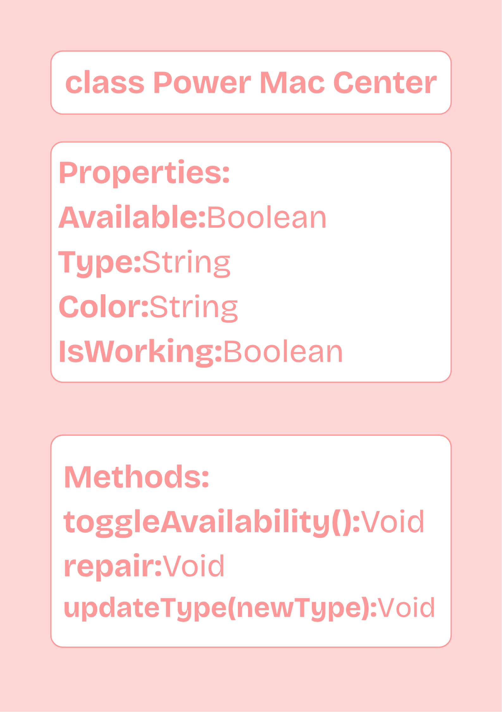

# Class Attributes and Methods
## Previous Design
Link to my previous activity:
[My Previous Activity](../MYOOPSeedSystemPT1)
## Design Revision
No changes were made, nor were needed in my previous design.
## Visibility Decisions
| Attribute | Data Type | Visibility | Reason |
|---|---|---|---|
|Available|Boolean|Private|Prevents unauthorized status changes unless handled by the store's check-in system|
|Type|String|Private|Keeps the product classification consistent and prevents accidental overwriting|
|Color|String|Private|Protects the product detail from being changed without tracking the modification.|
|IsWorking|Boolean|Private|Enforces safety soa broken product can only be marked active via repair method.|
## Updated UML Class Diagram

## Python Implementation

[View Python Source](classImplementation.py)
## Test Run

## Object Diagram

## Analysis
### Why did you make your chosen attribute private?
### Which method changes the state of your object?
### How did your two objects demonstrate that instances are independent?
### What is the difference between your class diagram and your object diagram?
