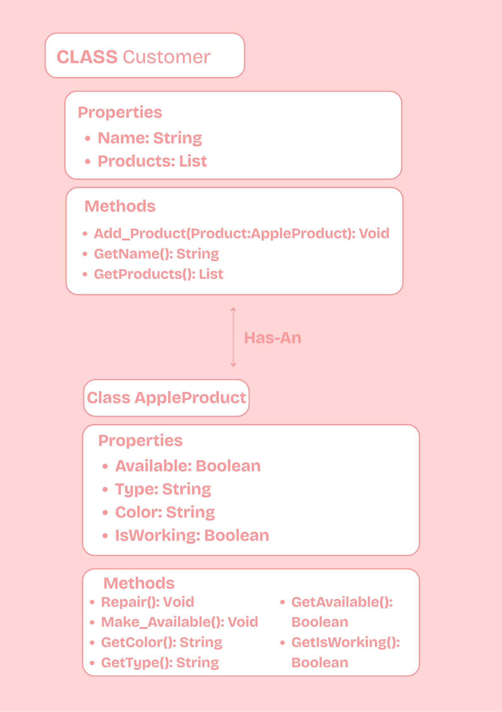
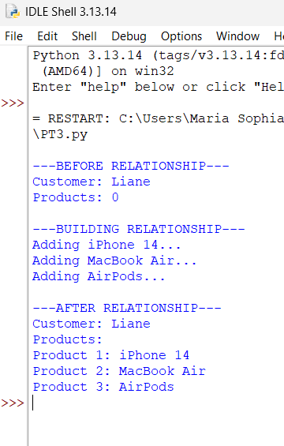
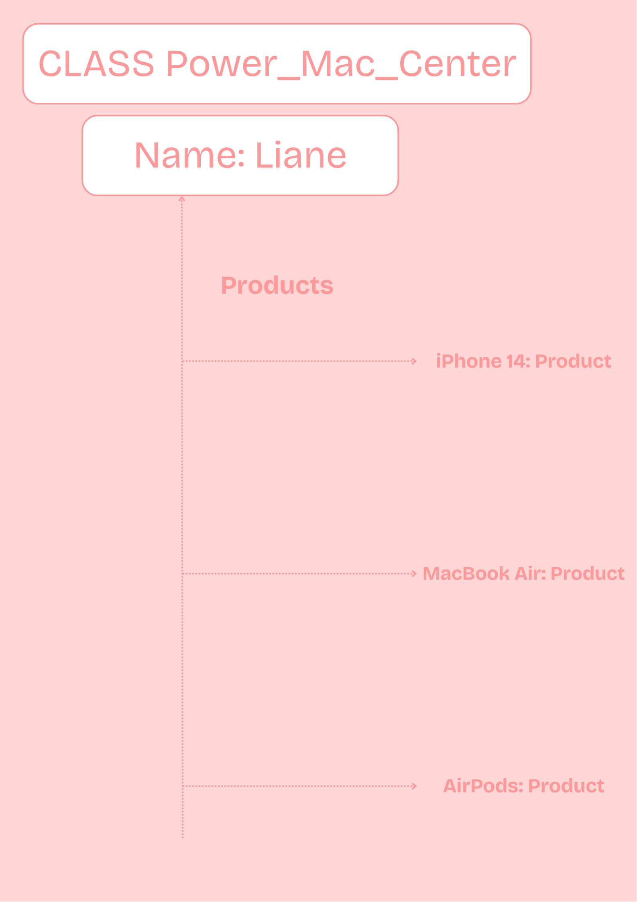

## Previous Work
[Part I - Classes and Objects](classObjectUML.md)

[Part II - Class Attributes and Methods](classAttributesMethods.md)

## Existing Class
Class: PowerMacCenter

Description: Represents Apple products that can be bought from Power Mac Center, such as an iPhone, MacBook, or AirPods.

## New Related Class
Class: Customer

Description: Represents a customer who can have or buy different Apple products.

## Association
Relationship: Customer has AppleProducts.

Explanation: A customer can be connected to different Apple products. The Customer class keeps the products in a list using the add_product() method

## Multiplicity
Multiplicity: One-to-many (1 : many)

Explanation: One customer can have multiple Apple products. For example, one customer can have an iPhone, MacBook, and AirPods.

## UML Class Relationship Diagram

## Python Implementation
[View Python Source](classRelationships.py)

## Test Run

## Object Relationship Diagram

## Analysis
### What is the association between your two classes?
The association is between a Customer and AppleProduct. A customer can have multiple Apple products.
### What multiplicity did you choose and why?
I chose one-to-many (1 : many) because one customer can have more than one Apple product.
### How did you implement the relationship in Python?
I implemented it by creating a list called __products in the Customer class. The add_product() method adds AppleProduct objects to the list.
### Why did you store an object reference instead of copying its data?
I stored the object itself so the customer can access the original product and its information without having to copy all of its attributes.
### If your relationship uses many, why is a list appropriate?
A list is appropriate because one customer can have multiple products. It also makes it easy to add, store, and display each product.
